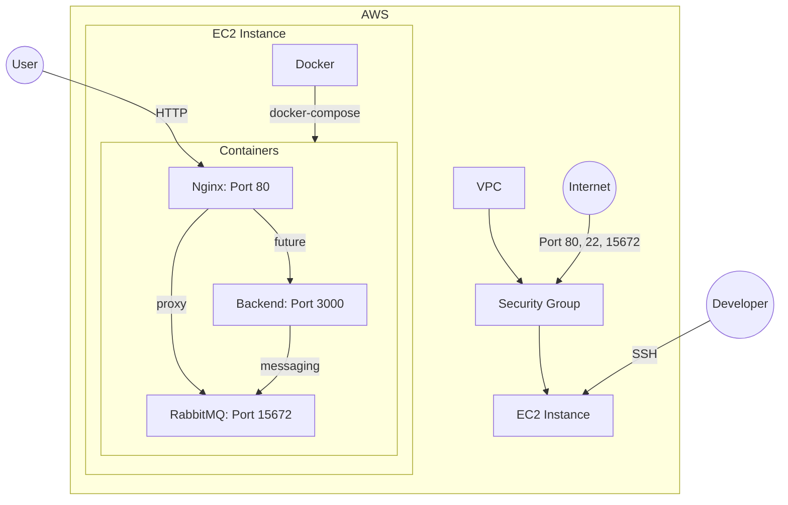
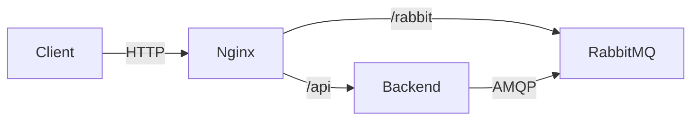

# Terraform EC2 Nginx RabbitMQ

Este projeto demonstra como usar Terraform para provisionar uma infraestrutura na AWS com uma instância EC2 executando Nginx e RabbitMQ em containers Docker, com planos para adicionar um backend no futuro.

## Arquitetura



### Componentes Atuais
- **AWS VPC**: Rede virtual onde todos os recursos são implantados
- **Security Group**: Controla o tráfego de entrada e saída para a instância EC2
- **EC2 Instance**: Máquina virtual executando Ubuntu 22.04
- **Docker + Docker Compose**: Gerencia os containers
- **Nginx**: Servidor web atuando como proxy reverso
- **RabbitMQ**: Sistema de mensageria com interface de gerenciamento

### Componentes Futuros
- **Backend**: API/Serviço que será adicionado posteriormente

## Estrutura do Projeto

```
terraform-ec2-nginx/
├── docker-compose.yml       # Configuração dos containers Docker
├── nginx.conf               # Configuração do servidor Nginx
├── user_data.sh             # Script de inicialização da instância EC2
├── .gitignore               # Arquivos ignorados pelo Git
└── terraform/               # Configuração do Terraform
    ├── main.tf              # Recursos principais da infraestrutura
    ├── variables.tf         # Declaração de variáveis
    ├── outputs.tf           # Saídas após o provisionamento
    └── data.tf              # Data sources (AWS VPC, AMI, etc.)
```

## Pré-requisitos

1. [Terraform](https://www.terraform.io/downloads.html) (v1.0.0+)
2. [AWS CLI](https://aws.amazon.com/cli/) configurado com credenciais válidas
3. Um par de chaves SSH para acesso à instância EC2

## Como Executar

### 1. Configuração das Variáveis Sensíveis

Crie um arquivo `terraform.tfvars` no diretório `terraform/`:

```
ssh_public_key = "sua-chave-ssh-pública"
```

### 2. Inicializar o Terraform

```bash
cd terraform
terraform init
```

### 3. Visualizar o Plano de Execução

```bash
terraform plan -out=plan.out
```

### 4. Aplicar o Plano

```bash
terraform apply plan.out
```

### 5. Acessar os Serviços

Após o provisionamento, você receberá o IP público da instância EC2 como saída.

- **Nginx**: http://[IP-PÚBLICO]
- **RabbitMQ Management**: http://[IP-PÚBLICO]:15672
  - Usuário: admin
  - Senha: 310109 (altere para uma senha segura em produção)

### 6. Acessar a Instância EC2 via SSH

```bash
ssh -i /caminho/para/sua/chave-privada ubuntu@[IP-PÚBLICO]
```

## Detalhes da Implementação

### Security Group

O Security Group permite o tráfego nas seguintes portas:
- 22 (SSH): Para acesso administrativo à instância
- 80 (HTTP): Para acesso ao Nginx
- 15672 (RabbitMQ Management): Para acesso à interface de gerenciamento do RabbitMQ
- 5672 (AMQP): Para comunicação do protocolo AMQP do RabbitMQ

### Nginx como Proxy Reverso

O Nginx está configurado para:
1. Servir uma página estática na raiz (/)
2. Redirecionar solicitações para /rabbit para a interface de gerenciamento do RabbitMQ

### Inicialização da Instância (user_data.sh)

O script de inicialização:
1. Instala Docker e Docker Compose
2. Cria os arquivos de configuração necessários
3. Inicia os containers definidos no docker-compose.yml

## Próximos Passos

### 1. Adicionar Backend



Modificações necessárias:
1. Adicionar o serviço do backend no docker-compose.yml
2. Atualizar a configuração do Nginx para encaminhar solicitações para o backend
3. Configurar a comunicação entre o backend e o RabbitMQ

### 2. Melhorias de Segurança

- Usar HTTPS com certificados SSL
- Usar AWS Secrets Manager para gerenciar senhas
- Restringir acesso às portas do Security Group

### 3. Monitoramento e Logs

- Adicionar CloudWatch para monitoramento
- Configurar alertas para métricas importantes
- Implementar logging centralizado

## Problemas Conhecidos e Soluções

### 1. Script user_data não é executado corretamente

Se o script de inicialização falhar, você pode verificar os logs:

```bash
sudo cat /var/log/cloud-init-output.log
```

E executar manualmente os comandos necessários para configurar o ambiente.

### 2. Permissões do Docker

Se encontrar problemas de permissão com o Docker:

```bash
sudo addgroup --system docker
sudo adduser $USER docker
newgrp docker
sudo snap restart docker
```

## Limpeza de Recursos

Para destruir todos os recursos criados:

```bash
terraform destroy
```

## Recursos de Aprendizado

- [Documentação do Terraform](https://www.terraform.io/docs/index.html)
- [AWS EC2 User Guide](https://docs.aws.amazon.com/AWSEC2/latest/UserGuide/concepts.html)
- [Docker Compose Documentation](https://docs.docker.com/compose/)
- [Nginx Documentation](https://nginx.org/en/docs/)
- [RabbitMQ Documentation](https://www.rabbitmq.com/documentation.html)
